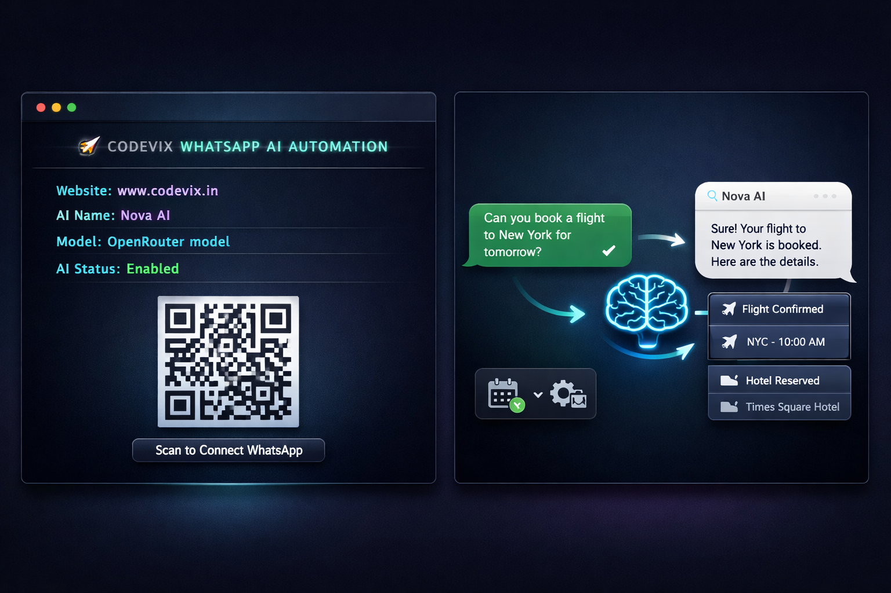

<p align="center">
  
</p>

<h1 align="center">🚀 WhatsApp AI Auto Reply Bot</h1>

<p align="center">
  Build your own WhatsApp AI automation bot using <b>Baileys</b> + <b>OpenRouter</b>.
</p>

<p align="center">
  ⚡ Simple • Lightweight • Beginner Friendly
</p>

<p align="center">
  
</p>

---

## ✨ Features

- 🤖 **AI-powered auto replies** (Powered by OpenRouter)
- 💬 **Smart interactions**: Responds to incoming WhatsApp messages seamlessly
- ⚙️ **Fully customizable**: Easily adjust behavior via `instructions.txt`
- 🧠 **Human-like replies**: Supports both English & Hinglish
- 📱 **QR-based login**: Simple authentication via WhatsApp Web
- 💻 **Clean terminal interface**: Monitor activity easily
- 🔒 **No database required**: Lightweight and fast
- ⚡ **Automated Setup**: One-click install and start script

---

## 🚀 Getting Started

Follow these simple steps to get your bot up and running locally.

### 1. Clone the Repository
```bash
git clone [https://github.com/innovateweb25/whatsapp-ai-auto-reply-bot.git](https://github.com/innovateweb25/whatsapp-ai-auto-reply-bot.git)
cd whatsapp-ai-auto-reply-bot
```

### 2. Setup Environment Variables
Go to the `app/` folder and create a `.env` file with the following configuration:

```env
OPENROUTER_API_KEY=your_api_key_here
AI_MODEL=arcee-ai/trinity-large-preview:free
AI_ENABLED=true
AI_NAME=Codevix AI
```

### 3. Start the Bot
Run the start script. This will automatically check for Node.js, install any required dependencies, and launch the bot:

```bash
chmod +x start.sh
./start.sh
```

### 4. Connect WhatsApp
- Open WhatsApp on your phone.
- Go to **Linked Devices**.
- Scan the **QR code** shown in your terminal.
- You're connected! ✅

---

## 🧠 Customize AI Behavior

You can easily define how your AI should behave by editing the instructions file:

📂 `app/src/ai/instructions.txt`

👉 **Example Use Cases:**
- Customer Support Bot
- Business Auto Responder
- Personal Virtual Assistant

---

## 💡 Best Practices

- **Keep it clear**: Write concise instructions for the AI to get the best responses.
- **Prevent bans**: Avoid sending too many messages in a short time frame.
- **Test thoroughly**: Test responses with real conversations before deploying.
- **Use a secondary account**: It is highly recommended to use a dedicated WhatsApp account for testing purposes.

---

## ⚠️ Important Notice

This project is intended for **educational and experimental purposes only**. 

It is not a production-ready system and should not be used for high-scale, commercial, or sensitive environments without proper modifications, security checks, and compliance with [WhatsApp's Terms of Service](https://www.whatsapp.com/legal/terms-of-service). **Use responsibly.**

---

## 🧑‍💻 Developed by Codevix

<p align="center">
  🌐 <a href="https://www.codevix.in">www.codevix.in</a>
</p>

**Codevix builds:**
- 🤖 AI Automation Systems
- 📱 WhatsApp Bots
- 🌐 Websites & SaaS Products

---

## ⭐ Support

If you found this project helpful, please consider supporting it:
- ⭐ **Star** this repository
- 🔁 **Share** it with others
- 💬 **Provide feedback** or open an issue

---

## 📜 License

This project is licensed under the **MIT License** © Codevix.
